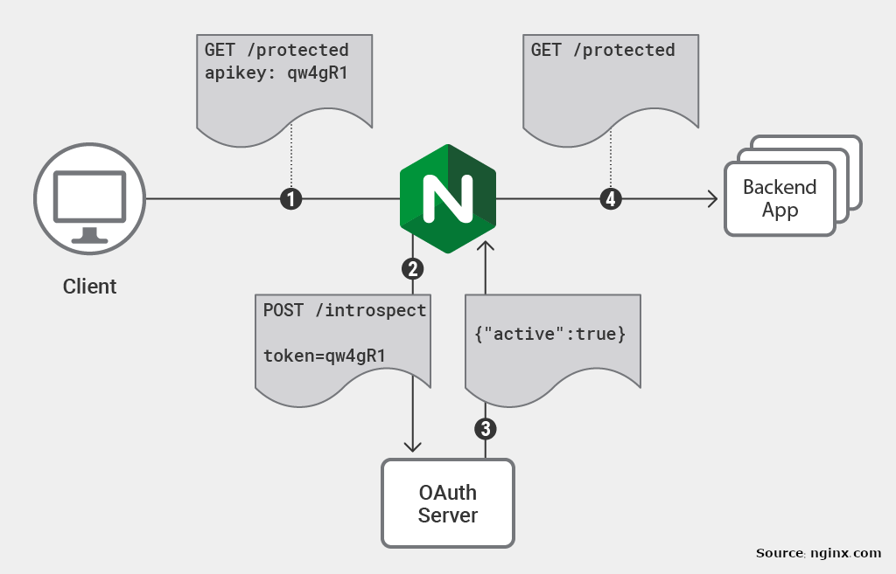

# micro-auth-request

[micro-auth-request](https://github.com/abdollahpour/micro-auth-request) is a tiny service that helps you using reverse proxy decouple the authentication from the services behind it. It's mainly designed to be used by [Nginx](https://www.nginx.com) or [nginx-ingress](https://github.com/kubernetes/ingress-nginx) (for Kubernetes) as reverse-proxy and Google as the authentication provider but you can also use it with other reverse proxies like [Traefik](https://docs.traefik.io) for you microservices or monolith that you have.

You can use micro-auth-request just by providing Google client ID and secret without the need to set up any other tools. But if you need something more, for example, if you want to also include roles of the user you need to add it manually. We believe in  [Convention over configuration](https://en.wikipedia.org/wiki/Convention_over_configuration) it's easier to add a  Javascript file rather than complicated limited configuration files.

# How it works?

[nginx auth_request](https://nginx.org/en/docs/http/ngx_http_auth_request_module.html) implements client authorization based on the result of a subrequest. The procedure is fairly simple, for any income request, nginx redirect the header of that request to micro-auth-request, based on the request headers (token, cookie, ...), it makes decistion if the user is authenticate or not. The original request will pass to the original service only if micro-auth-request return 200 to nginx. If authentication is required, micro-auth-request helps to use google for it and manage the procedure automatically.

# How to setup?
There are many ways to run micro-auth-request in your production environment.

## Using npm

(This method does not work at the moment because [NPM registry](http://npm.im/micro-auth-request) has some issues)

    GOOGLE_CLIENT_ID=<YOUR_CLIENT_ID> GOOGLE_CLIENT_SECRET=<YOUR_CLIENT_SECRET> npx micro-auth-request

## Using docker

    docker run -d -e OOGLE_CLIENT_ID=<YOUR_CLIENT_ID> -e GOOGLE_CLIENT_SECRET=<YOUR_CLIENT_SECRET> -p 8080:8080 abdollahpour/micro-auth-request

## Using HELM for kubernetes
Or if you are using kubernetes, using HELM:

    helm repo add micro-auth-request 'https://raw.githubusercontent.com/abdollahpour/micro-auth-request-helm/master/'
    helm repo update
    helm install \
        --set google.clinet_id=<YOUR_CLIENT_ID> \
        --set google.clinet_secret=<YOUR_CLIENT_SECRET> \
        --set ingress.enable=true \
        --set ingress.hosts[0]=yourdomain.com \
        micro-auth-request micro-auth-request

for more information please visit the [helm chart](https://github.com/abdollahpour/micro-auth-request).

# How to use it?
Using micro-auth-request you can cover four scenarios:
* User is authenticated, he can access the service behind the proxy.
* User is not authenticated, you want to redirect it to the login page (good for HTMLs).
* User is not authenticated, you want to return 401.
* User is not authenticated, but you still want to give him the access, but the service detects that there's no user signed in. An example usecase if a search engine, if a user is authenticated you want to customize the search result based on his profile, and if not, nothing will happen and we may use some other things, for example, IP or location.

Check the [example](example/) directory for more information.

# How to add more?
If you want to enrich the user info (add roles for example), you can edit `src/controller/redirect` and easily fetch more information from another service of the database.

If you need another authentication provider rather than Google, implement a new one. Copy `src/service/google.js` and use if as boilerplate for your own service. Then switch to it on `src\middleware\oauth.js`.
